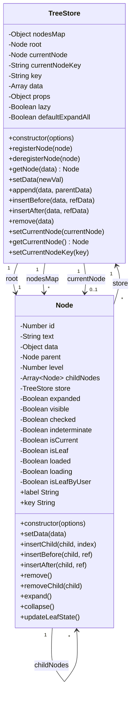

# Element Tree Copy

## TreeStore 和 Node 类关系图



### 关系表示法说明
- `"1"` 表示一对一关系
- `"*"` 表示一对多关系  
- `"0..1"` 表示零或一的关系
- `-->` 表示关联关系

### 类关系对应说明
1. **TreeStore "1" --> "1" Node : root**
   - TreeStore 拥有一个根节点，每个 TreeStore 实例都有且仅有一个根节点

2. **TreeStore "1" --> "*" Node : nodesMap**
   - TreeStore 通过 nodesMap 管理多个节点，一个 TreeStore 可以包含任意数量的节点

3. **TreeStore "1" --> "0..1" Node : currentNode**
   - TreeStore 可以有一个当前选中的节点，也可以没有当前节点

4. **Node "1" --> "0..1" Node : parent**
   - 每个节点可以有一个父节点，根节点没有父节点

5. **Node "1" --> "*" Node : childNodes**
   - 每个节点可以有多个子节点，叶子节点没有子节点

6. **Node "*" --> "1" TreeStore : store**
   - 多个节点都属于同一个 TreeStore，每个节点都必须有对应的 TreeStore 引用

### 代码实现层面的关系说明

#### 1. TreeStore 与根节点 (root) 的实现
```javascript
// 在 TreeStore 构造函数中创建根节点
constructor(options) {
  // ...其他初始化代码
  this.root = new Node({
    data: this.data,
    store: this
  });
}
```

#### 2. TreeStore 与节点映射表 (nodesMap) 的实现
```javascript
// TreeStore 中的节点注册机制
registerNode(node) {
  const key = this.key;
  if (!key || !node || !node.data) return;
  
  const nodeKey = node.key;
  if (nodeKey !== undefined) {
    this.nodesMap[node.key] = node; // 将节点添加到映射表
  }
}

// 通过映射表快速查找节点
getNode(data) {
  if (data instanceof Node) return data;
  const key = typeof data !== 'object' ? data : getNodeKey(this.key, data);
  return this.nodesMap[key] || null;
}
```

#### 3. TreeStore 与当前节点 (currentNode) 的实现
```javascript
// 设置当前节点
setCurrentNode(currentNode) {
  const prevCurrentNode = this.currentNode;
  if (prevCurrentNode) {
    prevCurrentNode.isCurrent = false; // 清除之前节点的当前状态
  }
  this.currentNode = currentNode; // 设置新的当前节点
  this.currentNode.isCurrent = true;
}

// 通过 key 设置当前节点
setCurrentNodeKey(key) {
  if (key === null || key === undefined) {
    this.currentNode && (this.currentNode.isCurrent = false);
    this.currentNode = null; // 可以设置为 null
    return;
  }
  const node = this.getNode(key);
  if (node) {
    this.setCurrentNode(node);
  }
}
```

#### 4. Node 与父节点 (parent) 的实现
```javascript
// 在 Node 构造函数中设置父节点关系
constructor(options) {
  this.parent = null; // 初始化为 null
  // ...复制 options 属性
  for (let name in options) {
    if (Object.prototype.hasOwnProperty.call(options, name)) {
      this[name] = options[name]; // 包括 parent 属性
    }
  }
}

// 插入子节点时建立父子关系
insertChild(child, index) {
  if (!(child instanceof Node)) {
    Object.assign(child, {
      parent: this, // 设置父节点引用
      store: this.store
    });
    child = new Node(child);
  }
}
```

#### 5. Node 与子节点 (childNodes) 的实现
```javascript
// Node 构造函数中初始化子节点数组
constructor(options) {
  this.childNodes = []; // 初始化空数组
}

// 插入子节点
insertChild(child, index) {
  // ...创建子节点实例
  if (typeof index === 'undefined' || index < 0) {
    this.childNodes.push(child); // 添加到末尾
  } else {
    this.childNodes.splice(index, 0, child); // 插入到指定位置
  }
}

// 移除子节点
removeChild(child) {
  const index = this.childNodes.indexOf(child);
  if (index > -1) {
    this.store && this.store.deregisterNode(child);
    child.parent = null; // 清除父节点引用
    this.childNodes.splice(index, 1); // 从数组中移除
  }
}
```

#### 6. Node 与 TreeStore (store) 的实现
```javascript
// Node 构造函数中建立与 TreeStore 的关系
constructor(options) {
  // ...其他初始化
  const store = this.store;
  if (!store) {
    throw new Error('[Node]store is required!'); // 强制要求 store
  }
  store.registerNode(this); // 将自己注册到 TreeStore
}

// 通过 store 访问全局配置和方法
get key() {
  const nodeKey = this.store.key; // 使用 store 的 key 配置
  if (this.data) return this.data[nodeKey];
  return null;
}
```

这些实现展示了如何在代码层面维护类图中定义的各种关系，确保数据结构的完整性和一致性。

## 关系说明

### TreeStore 类
- **作用**: 树形数据的存储和管理中心
- **核心属性**:
  - `root`: 根节点，类型为 Node
  - `nodesMap`: 节点映射表，用于快速查找节点
  - `currentNode`: 当前选中的节点
  - `data`: 原始数据数组
  - `props`: 属性配置对象

### Node 类
- **作用**: 树形结构中的单个节点
- **核心属性**:
  - `parent`: 父节点引用
  - `childNodes`: 子节点数组
  - `store`: 所属的 TreeStore 实例
  - `data`: 节点数据
  - `level`: 节点层级

### 数据关系
1. **组合关系**: TreeStore 拥有一个根节点 (root)
2. **聚合关系**: TreeStore 通过 nodesMap 管理多个节点
3. **双向引用**: Node 持有 TreeStore 的引用，TreeStore 管理所有 Node
4. **树形结构**: Node 之间通过 parent 和 childNodes 形成树形关系
5. **当前节点**: TreeStore 维护当前选中节点的引用