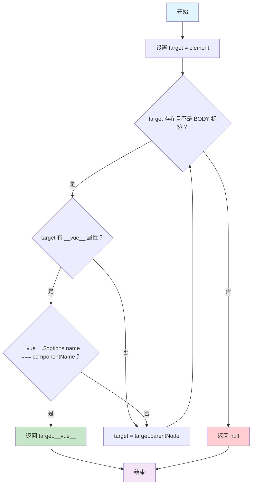

# Element Tree Copy 项目

## findNearestComponent 方法详解

### 方法概述

`findNearestComponent` 是一个用于在 DOM 树中向上查找最近的指定 Vue 组件实例的工具方法。该方法位于 `src/tree/src/model/util.js` 文件中。

### 方法签名

```javascript
export const findNearestComponent = (element, componentName) => {
  let target = element;
  while (target && target.tagName !== 'BODY') {
    if (target.__vue__ && target.__vue__.$options.name === componentName) {
      return target.__vue__;
    }
    target = target.parentNode;
  }
  return null;
};
```

### 参数说明

- **element**: `HTMLElement` - 起始的 DOM 元素，从该元素开始向上查找
- **componentName**: `string` - 要查找的 Vue 组件名称

### 返回值

- 返回找到的 Vue 组件实例（`Vue` 对象），如果未找到则返回 `null`

### 工作原理

该方法采用**向上遍历 DOM 树**的策略来查找指定的 Vue 组件：

1. **初始化目标元素**: 将传入的 `element` 赋值给 `target` 变量
2. **循环遍历**: 使用 `while` 循环向上遍历 DOM 树
3. **边界条件**: 当 `target` 为 `null` 或到达 `BODY` 标签时停止遍历
4. **组件检查**: 检查当前元素是否：
   - 存在 `__vue__` 属性（Vue 2.x 的组件实例引用）
   - 组件名称匹配 `componentName`
5. **返回结果**: 找到匹配组件则返回其实例，否则继续向上查找
6. **未找到处理**: 遍历完成后仍未找到则返回 `null`

### 可视化流程图



### DOM 树遍历示例

假设有以下 DOM 结构：

```
<body>
  <div id="app">
    <div class="container">
      <tree-component name="MyTree">
        <div class="tree-node">
          <span class="node-label">节点1</span>  ← 从这里开始查找
        </div>
      </tree-component>
    </div>
  </div>
</body>
```

查找过程：

```
步骤 1: target = <span class="node-label">
        检查: 无 __vue__ 属性
        操作: target = target.parentNode

步骤 2: target = <div class="tree-node">
        检查: 无 __vue__ 属性
        操作: target = target.parentNode

步骤 3: target = <tree-component>
        检查: 有 __vue__ 属性
        检查: __vue__.$options.name === "MyTree"
        结果: 匹配！返回 __vue__ 实例

如果不匹配，继续向上查找...
```

### 使用场景

1. **事件委托**: 在子元素上触发事件时，需要找到处理该事件的父组件
2. **组件通信**: 子组件需要与特定的祖先组件进行通信
3. **上下文查找**: 在复杂的组件嵌套中查找特定的上下文组件
4. **树形控件**: 在树节点中查找树组件实例以进行操作

### 注意事项

1. **Vue 版本兼容性**: 该方法使用 `__vue__` 属性，这是 Vue 2.x 的特性
2. **性能考虑**: 方法会向上遍历 DOM 树直到找到匹配组件或到达 BODY 标签
3. **组件命名**: 依赖于组件的 `name` 选项，确保目标组件正确设置了名称
4. **边界处理**: 当到达 BODY 标签时会停止查找，避免无限循环

### 代码特点

- **简洁高效**: 使用简单的 while 循环实现向上遍历
- **边界安全**: 通过检查 `target` 和 `tagName` 避免越界
- **Vue 集成**: 利用 Vue 的内部属性 `__vue__` 获取组件实例
- **灵活性**: 通过组件名称参数支持查找不同类型的组件